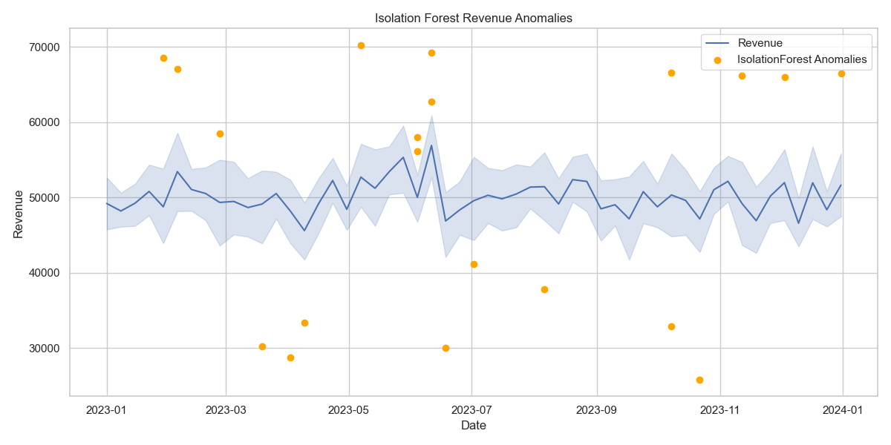

# 📊 BizPulse – Business Health & Risk Analyzer

**BizPulse** is a powerful data analytics and reporting tool built with Python that simulates business performance, detects anomalies using both statistical and machine learning techniques, and presents actionable insights through an interactive dashboard and automated PDF reports.

> 🔗 **Live App:** [Explore the Streamlit Dashboard](https://shareenmarydiengdoh-bizpulse-app-kxcgvp.streamlit.app/)  
> 📄 **Sample PDF Report:** [Download BizPulse_Report.pdf](output/BizPulse_Report.pdf)

---

## 🚀 Features

- 📈 **Realistic Business Simulation** – Generate synthetic data for Revenue, Profit, Customer Satisfaction, and Marketing Spend across regions and business units.
- 🔍 **Dual Anomaly Detection** – Detect unusual patterns using both Z-score and Isolation Forest for high confidence insights.
- 📊 **Interactive KPI Dashboard** – Real-time visualization of revenue trends, profit margins, customer sentiment, and regional breakdowns.
- 🧾 **PDF Report Generator** – Create automated business reports with charts, metrics, and flagged anomalies using ReportLab.
- 📤 **Exportable Results** – Save clean anomaly CSVs and download PDF reports directly from the project output.

---

## 📸 Preview

### 📍 Streamlit Dashboard (Live View)



### 🧾 Sample PDF Report

The PDF includes:
- Revenue & Profit Trends
- Anomaly Summary Table
- Correlation Heatmap
- KPI Summary Box

📄 [Download Sample Report](output/BizPulse_Report.pdf)

---

## 🛠 Tech Stack

| Layer        | Tools Used                            |
|--------------|----------------------------------------|
| Programming  | Python                                 |
| Data Handling| Pandas, NumPy                          |
| Visualization| Matplotlib, Seaborn, Plotly            |
| ML Models    | Z-score, Isolation Forest (Scikit-learn)|
| Dashboard    | Streamlit                              |
| Reporting    | ReportLab (PDF automation)             |

---

## 📁 Project Structure

bizpulse/
├── main.py # Main launcher script (if any pre-processing or CLI needed)
├── app.py # Streamlit dashboard app
├── data/ # Simulated business dataset
│ └── bizpulse_data.csv
├── output/ # Plots, anomaly CSVs, and PDF report
│ └── BizPulse_Report.pdf
├── src/ # All core project logic
│ ├── generate_data.py
│ ├── eda.py
│ ├── anomaly_detector.py
│ └── pdf_report.py
├── requirements.txt # All Python dependencies
└── README.md # Project overview and instructions
---

## 🧠 Use Cases

- 📊 Business Intelligence Dashboard Showcase  
- 🚨 Outlier Detection for Business Metrics  
- 🧾 Automated PDF Reporting Systems  

---

## 🛠 How to Run Locally

```bash
git clone https://github.com/your-username/bizpulse.git
cd bizpulse

# Install dependencies
pip install -r requirements.txt

# Run the Streamlit app
streamlit run app.py


