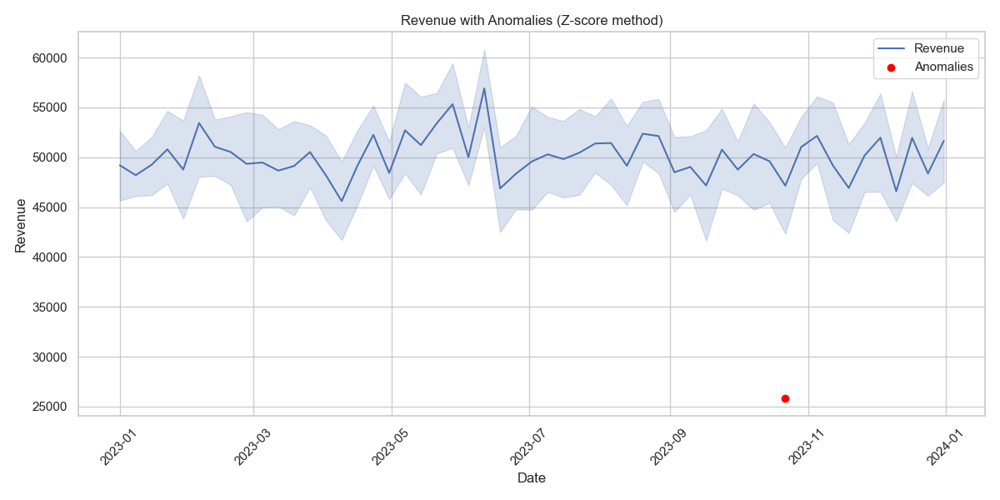

# 📊 BizPulse – Business Health & Risk Analyzer

**BizPulse** is a Python-based data analytics project that simulates and monitors business performance, detects revenue anomalies using both statistical and ML techniques, and visualizes KPIs using Streamlit and PDF reports.

---

## 🚀 Features

- 📈 Simulated sales & profit dataset (2023)
- 🧪 EDA with correlation heatmaps and region-wise trends
- 🚨 Anomaly detection using Z-score and Isolation Forest
- 🖥️ Interactive Streamlit dashboard with filters and KPIs
- 🧾 Auto-generated business PDF report with visuals

---

## 📦 Tech Stack

- Python, Pandas, NumPy  
- Matplotlib, Seaborn, Plotly  
- Scikit-learn (IsolationForest)  
- Streamlit  
- ReportLab (PDF generator)

---

## 📁 File Structure

BizPulse/
├── app.py # Streamlit dashboard
├── data/ # Generated business data
├── output/ # Plots, anomaly CSVs, PDF report
├── src/
│ ├── generate_data.py
│ ├── eda.py
│ ├── anomaly_detector.py
│ └── pdf_report.py
└── README.md
---

## 📸 Dashboard Screenshot



---

## 📥 PDF Sample Output

Download sample PDF: [BizPulse_Report.pdf](output/BizPulse_Report.pdf)

---

## 📌 How to Run

```bash
pip install -r requirements.txt
streamlit run app.py

